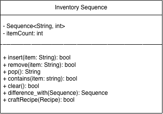

# MultiSet Design

## Introduction

My design is observing a a player inventory built utilizing a Sequence data structure `Sequence<String>`. This sequence data structure will be holding the items and quantity of each item. The inventory within the game will be visualized as a linear (1 dimensional) list of items instead of a grid or other 2 dimensional inventory system. This will allow the sequence data structure to be ideal due to the linear similarities between the structure itself and the inventory setup.

## Design Philosophy

As stated in the introduction, the purpose of utilizing the sequence data structure is because it has a very similar setup as the inventory type used within the game. Since the inventory grows as each unique item is obtained, we only have to expand search time when a unique item is added. Since the inventory is only housing items and item quantities, there should be no reason to over-complicate the data structure by using an AVL tree or other related data structure. We will simply be searching for an item with the same name as the input. There are no uses for having the data structure in sorted order such as using an AVL tree. 

The **user** would be whoever is developing the inventory class. **client** would be the inventory class itself.

## Core Operations

Core operations when utilizing the sequence data structure would be remove, pop, contains, and clear. When looking into the remove operation, this would be utilized if a player trades an item or sells an item. The operation would remove the item from the players inventory as well as remove the quantity (if the player trades or sells all of that item). The time complexity of the remove operation would be O(n) because the linked list could possibly be searched in its entirety before reaching the correct item. 

The **pop** operation would be good for removing the latest item gained by the player. This would be useful if the player goes over a trap or some type of negative interaction, and is punished by having the latest aquired item be stripped from them. The time complexity of the pop operation would be O(1) because it does not need to search the list, it just needs to pop the item on the top of the list. 

The **contains** operation would be useful for a lot of cases in a video game, for this example we can look at a door which needs a key to pass. If the key is in the players inventory, the player can pass, and if the player does not contain the key, they cannot pass. The contains operation would have a time complexity of O(n) because at it's worst case, the entire list may need to be traversed. 

The **clear** operation is good for when a player dies or gets robbed. If the player dies, the entire inventory's data structure can be deleted and a new inventory or sequence data structure is initialized. The time complexity of this operation would be O(1) because all it's doing is erasing the data structure and initalizing a new one. 

The **remove** data structure would be good for either dropping an item, or buying an item from a shop. If the player has currency on them, the remove operation can remove the amount of currency the player is holding based on the price of the item. The time complexity of this would be O(n) because the currency could be anywhere within the players inventory. 

## Set Operations

When looking into the `difference_with()` operation, we can see the items you have but another player does not have. This is particularly useful when entering a common area with other live players and bartering specific items which another player has that you don't. This can be in the context of a trading house or some other common area for players. This operation will look at each item in your inventory and compare it to each item in the other players inventory, if the other player does not have the item, that item is flagged and the operation continues out until it has checked every item. After the operation checks every item, a menu is displayed showing all the items you do not have that the other player has. The other player views the same menu but its items you have that they currently don't have. 

This operation will not explicitly manipulate the sequence data structure, but it will view it multiple times and perform it's own operations based on the data it sees. The conceptual time complexity of this would be O(n) because it will have to check every item in your inventory as well as every item in the other players inventory. 

## Extension Feature

The new capability for my multi-set would be `craftRecipe()`. This feature would be perfect to implement on a player's inventory because it can check to see if you have all the correct items needed to craft the recipe. It can also utilize the remove function to remove those items based on the quantity of items needed within the recipe. This could save syntax and possibly runtime if you incorporated the craftRecipe() function with the inventory's sequence data structure. Everything would be closely tied together and could perform at good speeds because of the minimal code additions needed to implement this craftRecipe() function. 

## UML Diagram / Abstraction Boundary

The UML diagram of the inventory is shown above. The variable itemCount is required to keep track of the amount of items within the inventory so it can be returned in a faster amount of time O(1). The insert, remove, clear, and craftRecipe operations all return a bool to verify if the operation succeeded or not. The rest of the operations have return types which match the desired outcome of calling the function. 

## Trade-off Analysis

When looking into the other data structures used for the inventory, we can see several downsides. Specifically looking into the AVLTree data structure, the inventory system implemented in the way I explained earlier (linear), would not need an advanced data structure like the AVLTree. This would be perfect for a linked list "in searching for a singly linked list, there is only one way to search through it that is linear searching" [1]. The AVLTree would be helpful when sorting items in a specific order, or comparing rarities of the items based on value. Since this inventory system is grown as you gain each item, it only makes sense to use a linear data structure rather than a tree-like data structure. 

|                           | Sequence                                                     |                           AVL Tree                           |
| ------------------------- | :----------------------------------------------------------- | :----------------------------------------------------------: |
| Pop() function            | The sequence data structure would easily be able to keep track of what the latest item inserted was and would be able to easily remove it by just going to the first element and removing it. This time complexity would be O(1). | The AVL Tree data structure would need to incorporate extra steps in order to find the last inserted item. The AVL Tree specializes in balanced order, not the order of insertion. The time complexity would be O(log n). |
| Data Structure Complexity | The sequence data structure is simple and easy to implement into an existing video game as the inventory structure. | The AVL Tree is over complicated and performs un-required balances and rotations. There is no reason to be doing this with an inventory. |
| Synax Additions           | The sequence data structure does not need excessive amounts of variables and things to keep track of. | The AVL Tree needs to keep track of left and right pointer as well as the height for each node, overcomplicating the process and involving more memory. |

## Alternative Design Sketch

If I were to utilize another data structure such as the AVL Tree, I would set things up in a different way. First, I would re-design the remove operation. I would need to remove the node when the quantity reaches 0 and rebalance the tree after doing so. Also, If I were to use the AVL Tree, I would change the contains operation and binary search the tree, which ultimately is faster than the sequence data structure with the AVL Tree performing it with a O(log n) time complexity. 

## Evaluation Plan

If this design were implemented I would test it by first starting with a light load of input's (1 or 3 items), to make sure all of the functions are working correctly. I would start by inserting a few items, then checking their existence with the contains() function, then removing the item and seeing if the sequence stays in tact and correct (stays linear). After this, I would test it on a large load of inputs (200 or so items), and test a large amount of function iterations to make sure the runtime stays consistent and nothing breaks. This sequence will be able to adapt to new features because the sequence is a class with variables and methods which are able to be implemented if another function were created within the class. All of these functions and variables are able to be used which already exist within the sequence class. 

## Conclusion / Reflection

This design is strong and effective because when you are looking at a linear inventory setup, the linked list (sequence) is the most logical answer to implement. The sequence itself is linear, grows only when a user picks up a new item, and has flexibility if there were any additions to the structure itself such as a new function. 

## Sources

[1] A. A Alnoshan Hessah, “Evaluation the Performance of Data Structures: A Comparative Approach,” *International Journal of Science and Research (IJSR)*, vol. 12, no. 8, pp. 880–885, Aug. 2023, doi: https://doi.org/10.21275/sr23807001651.

[2] GeeksforGeeks, “C++ Program to Implement AVL Tree,” *GeeksforGeeks*, Jul. 15, 2024. https://www.geeksforgeeks.org/cpp/cpp-program-to-implement-avl-tree/

‌

‌
